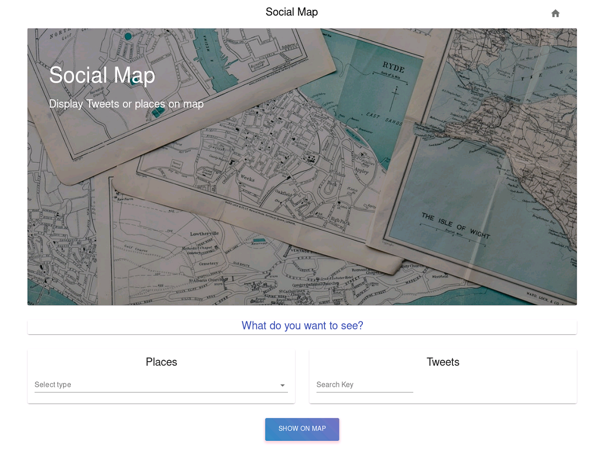

*[English](README.md), [Türkçe](README.tr.md)*

# social-map

This project is created by [Sena Erdoğan](https://github.com/senaerdogan) within the scope of My Security Analytics 2020 summer internship program. The aim of the project is to display social activities in a particular region on the map. In this context, the locations according to the selected category are shown on the map using [Google Maps](https://developers.google.com/maps/documentation/javascript/get-api-key). Then, using the [Twitter API](https://developer.twitter.com/en/docs/twitter-api), the `tweets` with the specified keyword are pinned on the map.

Different technologies is used in the project to broaden the horizons of the developer. For server operations [node.js](https://nodejs.org/en/), for interface [React](https://reactjs.org/) and for logging [mongoDB](https://www.mongodb.com/) is used in order to provide the highest level of benefit.

## Requirements

Environment variables are defined in the `example.env` file, after changing the file as `.env`, variables should be filled. An `API Key` to search Google Maps data, `Authorization Token` to use Twitter data and `mongoDB` connection properties to keep user logs needs to be specified.

## Install

Download project codes, specify the environment variables mentioned above and open project folder and then type `docker-compose up -d`. Afterwards, the application can be accessed from `locahost:8080`.

# Screenshots

## Main Screen

## Google Maps

## Twitter

